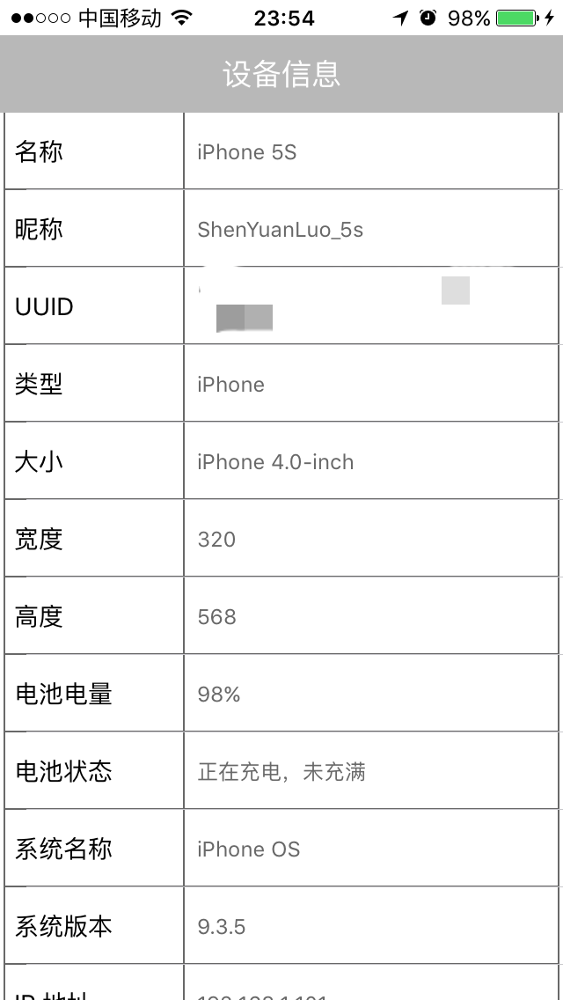
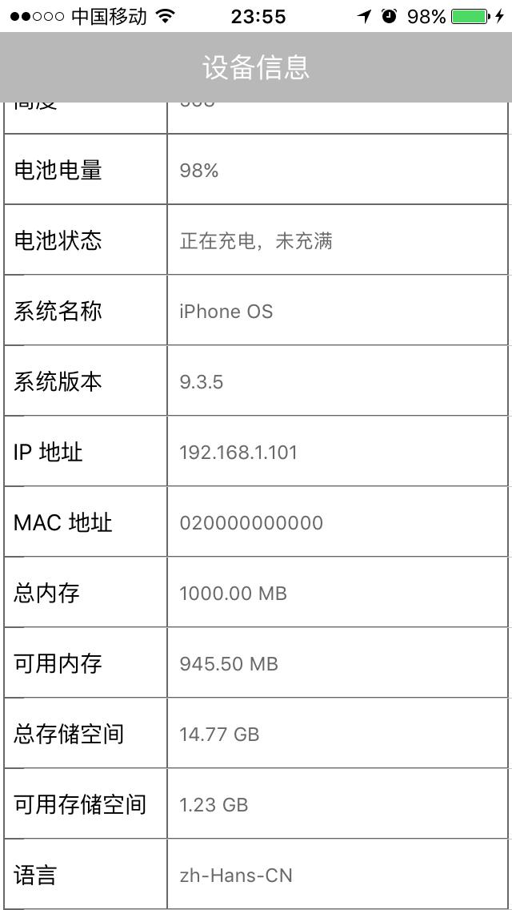
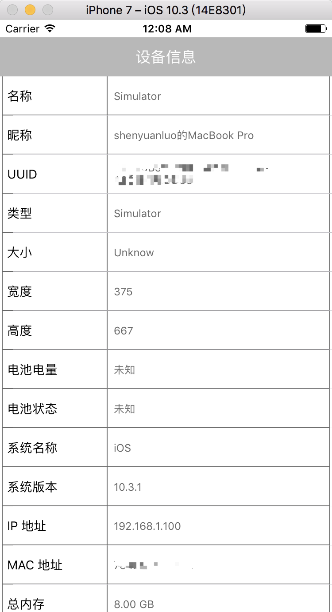
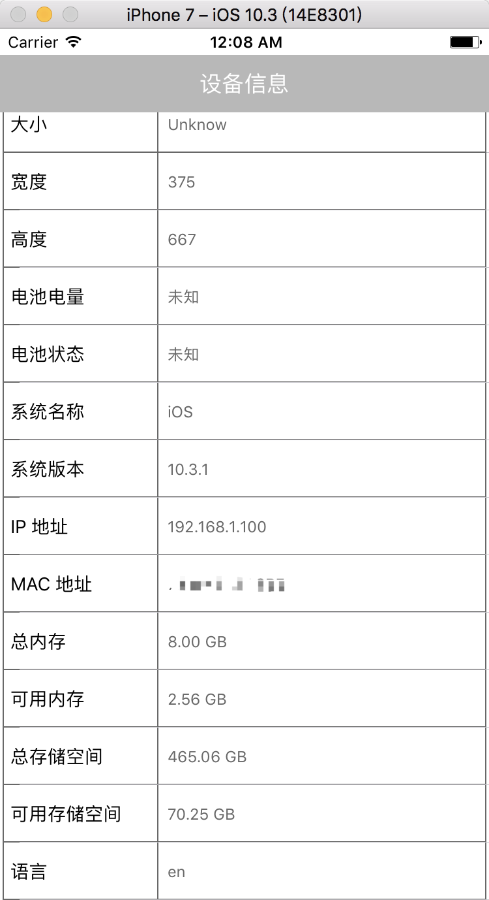

# SYDeviceInfo
> 获取 iOS 设备信息。









## 获取当前设备的'名称'
``` Objective-C
/**
 获取当前设备的'名称'，参见'SYNameType'
 
 @return 具体的设备类型, 参见‘DeviceType’
 */
+ (SYNameType)syDeviceName;
```

## 获取当前设备的‘类型’
``` Objective-C
/**
 获取当前设备的‘类型’，参见'SYDeviceType'
 
 @return 设备类型，参见‘SYDeviceType’
 */
+ (SYDeviceType)syDeviceType;
```

## 获取当前设备屏幕的‘大小’
``` Objective-C
/**
 获取当前设备屏幕的‘大小’，参见'SYScreenType'
 
 @return 屏幕大小，参见‘ScreenType’
 */
+ (SYScreenType)syScreenType;
```

## 获取设备昵称
``` Objective-C
/**
 获取设备昵称
 
 @return 昵称
 */
+ (NSString *)syNickName;
```

## 获取通用唯一识别码‘UUID’
``` Objective-C
/**
 获取通用唯一识别码‘UUID’
 
 @return UUID
 */
+ (NSString *)syUUID;
```

###  获取屏幕宽度
``` Objective-C
/**
 获取屏幕宽度
 
 @return 屏幕宽度
 */
+ (CGFloat)syDeviceWidth;
```

## 获取屏幕高度
``` Objective-C
/**
 获取屏幕高度
 
 @return 屏幕高度
 */
+ (CGFloat)syDeviceHeight;
```

## 获取电池电量
``` Objective-C
/**
 获取电池电量
 
 @return 电量
 */
+ (CGFloat)syBatteryLevel;
```

## 获取电池当前的状态
``` Objective-C
/**
 获取电池当前的状态
 
 @return 电池状态，参见‘SYBatteryState’
 */
+ (SYBatteryState)syBatteryState;
```

## 获取系统名称
``` Objective-C
/**
 获取系统名称
 
 @return 系统名称
 */
+ (NSString *)sySystemName;
```

## 获取系统版本号
``` Objective-C
/**
 获取系统版本号
 
 @return 系统版本号
 */
+ (NSString *)sySystemVersion;
```

## 获取设备 IP 地址
``` Objective-C
/**
 获取设备 IP
 
 @return 设备 IP
 */
+ (NSString *)syDeviceIp;
```

## 获取设备 MAC 地址
``` Objective-C
/**
 获取设备 MAC 地址
 
 @return 设备 MAC 地址
 */
+ (NSString *)syDeviceMac;
```

## 获取总内存大小
``` Objective-C
/**
 获取总内存大小
 
 @return 总内存大小
 */
+ (unsigned long long)syTotalMemory;
```

## 获取可用内存
``` Objective-C
/**
 获取可用内存
 
 @return 可用内存
 */
+ (unsigned long long)syFreeMemory;
```

## 获取总存储空间大小
``` Objective-C
/**
 获取总存储空间大小
 
 @return 总存储空间大小
 */
+ (unsigned long long)syTotalSpace;
```

## 获取可用存储空间大小
``` Objective-C
/**
 获取可用存储空间大小
 
 @return 可用存储空间大小
 */
+ (unsigned long long)syFreeSpace;
```

## 获取当前语言
``` Objective-C
/**
 获取当前语言
 
 @return 当前语言
 */
+ (NSString *)syLanguage;
```